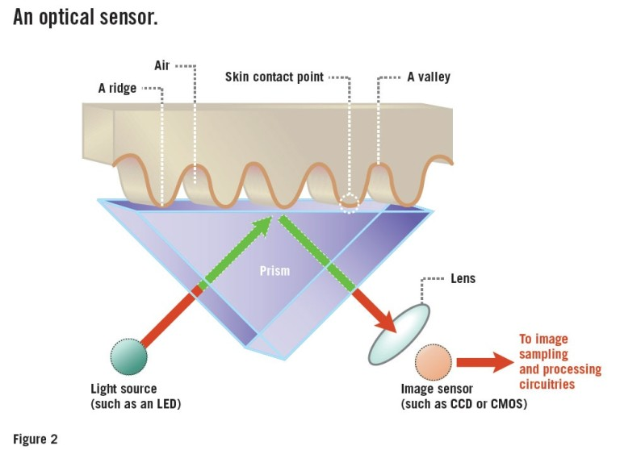

# Lectores De Huella Digital

* Un sensor colocado en el lector capta una imagen de tu huella como si tomara una foto y de ella reconoce las zonas más claras y más oscuras para ver la forma de la huella. La confianza en este tipo de lector depende de la resolución del sensor, la capacidad de crear una imagen de la huella lo más detallada posible para luego compararla. Pero pese a todo no son lectores muy seguros puesto que no es capaz de diferenciar entre una huella real en 3D y una foto de una huella en 2D.

* Los lectores capacitativos son los más utilizados hoy en día en teléfonos móviles. Utilizan una gran cantidad de condensadores minúsculos que almacenan energía dependiendo de la forma de la huella.
* Por lo tanto, si colocas tu huella sobre uno de estos sensores, los condensadores que toquen los salientes de tu huella tendrán una carga y los que no tendrán otra carga, formándose una huella digital en detalle con las concavidades de tu huella.
* Los lectores por ultrasonidos son los últimos en llegar y los que más investigación tienen actualmente.

Estos lectores disponen de un emisor y receptor de ultrasonidos. El emisor manda ultra sonidos hacia la huella y estos rebotan de diferente manera e intensidad. De esta manera vuelven los ultrasonidos al lector donde el receptor los registra y es capaz de generar una huella digital en tres dimensiones.

* Una vez pones la huella, el sistema operativo es el que sabe que llave escoger y es esa la que envía a los servidores de la página web o aplicación. De esta manera no se puede acceder a la huella y por tanto iniciar sesión con ella a no ser que el sistema no la haya protegido bien o que a través de root algún código pueda acceder a esta información.

